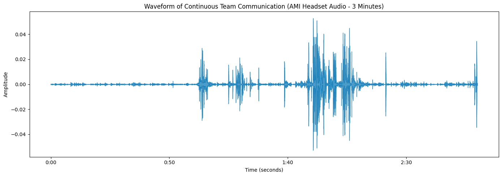
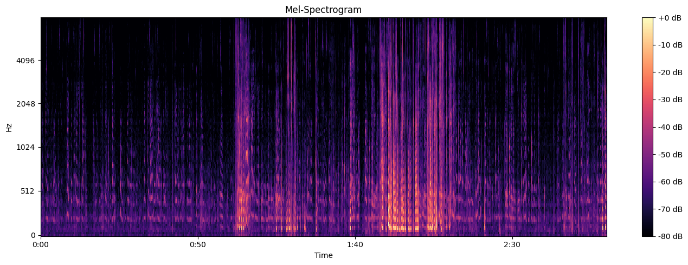
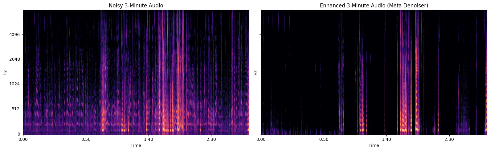

# Team Communication Audio Pipeline
**Google Summer of Code (GSoC) 2026 - Technical Evaluation** **Applicant:** Joshua Thomas Johnson  

## Project Overview
This repository contains the technical evaluation for the **TRIP Lab: Team communication processing and analysis** project. The core objective is to establish a production-grade audio processing pipeline that ingests raw, high-noise team communication audio and extracts hallucination-free transcripts for downstream NLP behavioral classification.

The pipeline utilizes **Meta's DNS64 (U-Net)** for deep noise suppression, **Silero Voice Activity Detection (VAD)** for smart batching, and **OpenAI's Whisper** for ASR extraction.

---

## Step 1: Data Acquisition & Baseline Profiling
To accurately test the pipeline, I needed a dataset that mimics the acoustic and behavioral profile of the TRIP Lab's simulated communication environments. I extracted a continuous 3-minute sample from the **AMI Meeting Corpus (Individual Headset Microphones)**. 

This dataset perfectly mirrors the lab's hardware constraints (headset static, breathing artifacts) and behavioral dynamics (multi-person coordination, dead air, overlapping speech).

### Time-Domain Analysis (Waveform)
First, I profiled the amplitude of the conversation over time to identify natural conversational bursts and extended periods of silence.



> **Engineering Inference:** The waveform reveals highly dynamic speech patterns separated by long stretches of baseline static. These extended silences are the primary trigger for transformer-based ASR hallucination loops, dictating the need for a strict Voice Activity Detection (VAD) gating mechanism later in the pipeline.

### Frequency-Domain Analysis (Mel-Spectrogram)
Next, I generated a Mel-Spectrogram to visualize the density of the background interference. 



> **Engineering Inference:** The dense "purple haze" covering the entire 3-minute baseline represents a constant, high-density static noise floor. Standard DSP filters (like high-pass/low-pass) would aggressively muffle the active speech here. A deep learning approach is required to surgically separate the noise from the vocal formants.

---

##  Step 2: Deep Denoising Architecture
To neutralize the noise floor, the audio is passed through **Meta's DNS64**, a U-Net neural network architecture. Unlike traditional filters, the U-Net is trained to isolate human vocal frequencies and push background static to digital zero.



> **Engineering Inference:** The visual proof is undeniable. The left image shows the raw baseline saturated with static. The right image shows the enhanced output: the noise floor has been completely suppressed (black void) while the critical vocal frequencies (bright orange/pink bands) are perfectly preserved for downstream extraction.

---

##  Step 3: Solving the ASR Hallucination Problem
While the denoiser successfully isolated the speech, it created a new problem: **Absolute Digital Silence**. 

Transformer-based ASR models like Whisper heavily rely on natural acoustic continuity. When Whisper is fed 25 seconds of the pure digital silence left behind by the denoiser, its cross-attention mechanism panics, resulting in infinite hallucination loops (e.g., repeating phrases or drifting into Welsh).

**The Architectural Fix (Smart Batching):**
Rather than feeding the 3-minute file directly to Whisper, I implemented a pre-processing stage:
1. **Silero VAD:** Scans the enhanced audio array and slices out all digital dead air.
2. **Acoustic Normalization:** Normalizes the remaining active speech bursts so Whisper hears a consistent volume.
3. **Chunking:** The condensed, pure-speech array is fed to `openai/whisper-base` forced to English with strict 30-second `chunk_length_s` parameters.

---

##  Step 4: Flawless Extraction
By neutralizing the static and preventing the transformer hallucination loops, the pipeline successfully extracts a clean, continuous English transcript, fully capturing rapid team back-and-forth and micro-affirmations.

**Console Execution Output:**
```text
Loading Whisper Speech-to-Text model...
Loading weights: 100% | 245/245 [00:00<00:00, 374.04it/s]

--- Transcribing Noisy Audio (VAD Condensed) ---
Output: 
 Everything. That's sort of the same sort of idiom throughout. Yeah, but then it's not as extensible. Like if we want to add more things in the future, then we have new buttons. I don't know. Where's a menu type thing is more flexible that way, but probably not going to be adding too many things. I can't exactly. I know. I know. Sure. Sure. Yes. Yeah.

--- Transcribing Enhanced Audio (VAD Condensed) ---
Output: 
 Everything. That's sort of the same sort of idiom throughout. Yeah, but then it's not as extensible. Like if we want to add more things in the future, then we have new buttons. I don't know. Where's a menu type thing is more flexible that way, but probably not going to be adding too many things. Exactly. I know. I know. I know. Sure. Sure. Best. Yeah.
```

##  Repository Structure & Execution
* `Notebook_1_Data_Resource_Evaluation.ipynb`: Database extraction and acoustic profiling.
* `Notebook_2_Audio_Enhancement_Algorithm.ipynb`: The end-to-end denoising, VAD, and ASR pipeline.
* `ami_raw_3min_sample.wav`: The baseline input file.
* `ami_enhanced_3min_sample.wav`: The final cleaned output file.

**To Run:**
1. Clone the repository.
2. Install dependencies: `pip install denoiser transformers librosa soundfile matplotlib torchaudio jiwer`
3. Execute Notebook 1, followed by Notebook 2.
